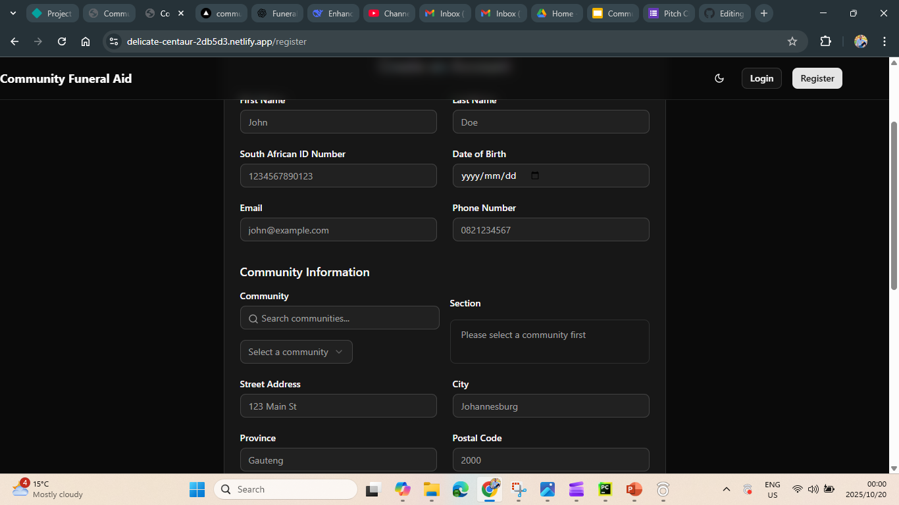
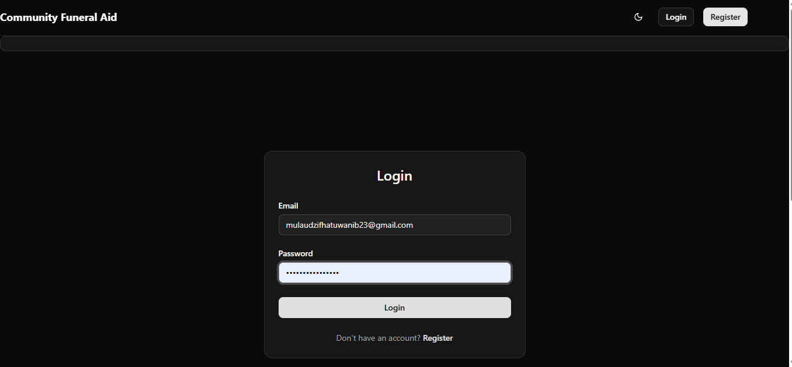
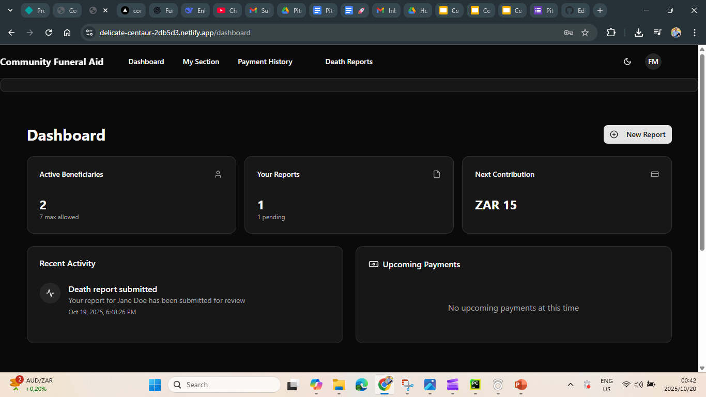

# 🕊️ Community Funeral Aid

**Community Funeral Aid** is a full-stack web application that helps community members contribute funds to support each other during bereavements. The platform manages contributions, beneficiaries, payments, and verifications — bringing transparency and automation to community-based funeral aid systems.

🔗 **Live Demo:** [Community Funeral Aid](https://delicate-centaur-2db5d3.netlify.app/)

---

## 📸 Preview

Below are key pages from the **Community Funeral Aid** platform showcasing the user experience — from registration to reporting and managing community contributions.

| Register | Login | Home Page |
|-----------|--------|------------|
|  |  |  |

| Dashboard | Add Beneficiary | Add Death Report | Add Community |
|------------|----------------|------------------|
|  |  |  | 

| Death Report List | Death Reports Page |
|--------------------|--------------------|
|  |  |


## 🚀 Features

### 👥 Member Management
- Users can register, verify their identity, and join community sections.
- Each user can add up to **7 beneficiaries**.
- Users can update their profile information and manage contact details.

### ⚰️ Funeral Contributions
- Members contribute **R25** when a community member or their beneficiary passes away.
- A portion (**R3–R5**) of each contribution is retained by the platform as revenue.
- Contribution tracking and notifications for each funeral event.

### 💸 Payments & Activation
- New members pay a **R50 activation fee** to join.
- If a user misses 2 funeral contributions:
  - Their account is **deactivated**.
  - They must pay **R50 reactivation fee**.
  - A **1-month waiting period** applies before reactivation.
- Payments are processed securely using **PayFast** with **ITN (Instant Transaction Notification)** integration.

### 🧾 Verification System
- **VerifyIT API** is integrated for:
  - **ID verification**
  - **Death certificate validation**

### 🏢 Business & Advertising
- Funeral businesses can **advertise** to communities.
- Advertising rates are determined based on **community member count**.

### 🔔 Notifications
- Members receive **SMS** and **email alerts** for:
  - New funeral contributions
  - Missed payments
  - Activation status updates

---

## 🧰 Tech Stack

| Layer | Technology |
|-------|-------------|
| **Frontend** | React or Angular |
| **Backend** | Node.js + Express |
| **Database** | MongoDB / MariaDB |
| **Payments** | PayFast API |
| **Verification** | VerifyIT API |
| **Notifications** | Email + SMS Integration |
| **Authentication** | JWT-based auth system |

---

## ⚙️ Installation

### Prerequisites
- Node.js v18+  
- npm or yarn  
- MongoDB  
- PayFast and VerifyIT credentials  

### Setup
```bash
# Clone the repository
git clone https://github.com/yourusername/community-funeral-aid.git

# Navigate into the project folder
cd community-funeral-aid

# Install dependencies
npm install

# Create a .env file and add your configuration
cp .env.example .env

