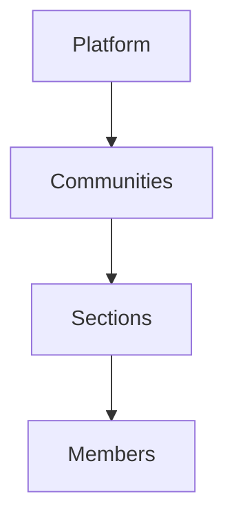

# Community Funeral Aid - Project Documentation

## Table of Contents

1. [Project Overview](#project-overview)
2. [Core Features](#core-features)
3. [Technical Architecture](#technical-architecture)
4. [Database Schema](#database-schema)
5. [API Endpoints](#api-endpoints)
6. [Workflows](#workflows)
7. [Security Considerations](#security-considerations)
8. [Third-Party Integrations](#third-party-integrations)
9. [Testing Strategy](#testing-strategy)
10. [Deployment Plan](#deployment-plan)

## Project Overview

A mutual aid platform where community members contribute small amounts to support families who have lost loved ones. The system organizes users into communities and sections for targeted support.

**Key Objectives:**

- Facilitate funeral expense contributions within trusted networks
- Prevent fraud through multi-layer verification
- Automate payment flows and notifications
- Provide transparency through reporting

## Core Features

### 1. Community Structure

# Technical Architecture

## Frontend

- **Framework:** React 18
- **UI Library:** shadcn/ui + Tailwind CSS
- **State Management:** React Query
- **Routing:** React Router 7
- **Real-time:** Socket.IO

## Backend

- **Runtime:** Node.js 20
- **Framework:** Express.js
- **Database:** MongoDB Atlas
- **ODM:** Mongoose
- **Authentication:** JWT + bcrypt

# Third-Party Integrations

| Service          | Purpose                        |
| ---------------- | ------------------------------ |
| PayFast          | Payment processing             |
| Twilio           | SMS notifications              |
| Home Affairs API | Death certificate verification |
| AWS S3           | Document storage               |

# Deployment Infrastructure

| Component    | Platform                   |
| ------------ | -------------------------- |
| Frontend     | Vercel                     |
| Backend      | AWS Elastic Beanstalk      |
| Database     | MongoDB Atlas (M2 cluster) |
| File Storage | AWS S3                     |

# Fraud Prevention

- Cross-verify death certificates with Home Affairs API
- Require 10+ member approvals
- Admin final verification
- Payment threshold limits

# CI/CD Pipeline

1. Linting (ESLint)
2. Type checking (TypeScript)
3. Run unit tests
4. Build artifacts
5. Deploy to staging
6. Manual approval step
7. Deploy to production
